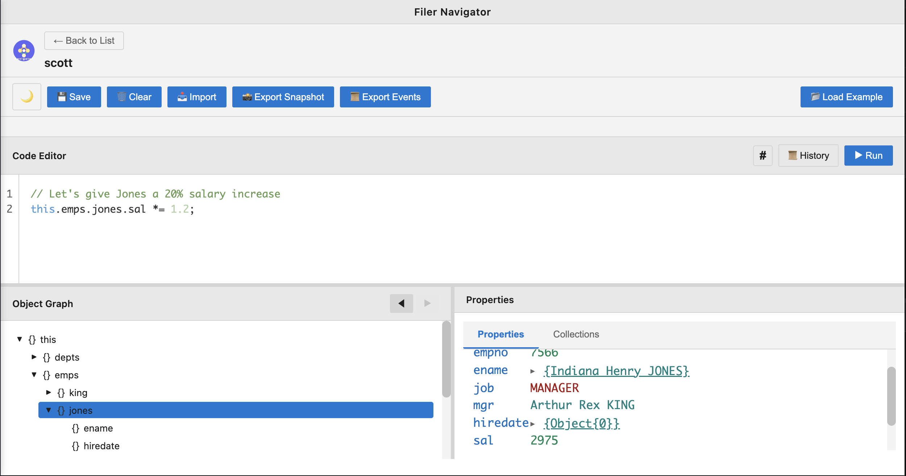

# Filer: Desenvolvimento Orientado a Domínio Sem Infraestrutura

**Modelagem conceitual de domínio + persistência transparente com event sourcing + interfaces gráficas ricas sintetizadas —tudo no navegador, sem servidor, zero dependências.** Defina seu domínio no nível conceitual (p. ex. E/R), e o Filer sintetiza protótipos JavaScript, persistência, validação e interfaces de usuário interativas em tempo real. Seus dados e seu esquema coexistem como iguais na mesma imagem de memória, permitindo flexibilidade sem precedentes: mude o esquema, os dados existentes se adaptam automaticamente. Sem migrações, sem ORMs, sem impedância de descompasso—apenas objetos JavaScript que persistem a si mesmos e interfaces gráficas que se materializam a partir dos metadados.



*Exploração interativa de domínio: navegue seus grafos de objetos, execute JavaScript, visualize relacionamentos—tudo sem servidor ou banco de dados.*

---

## Visão: Modelagem Autônoma de Domínios

O Filer permite que você **defina e execute seus próprios domínios localmente**—sem servidores, bancos de dados ou infraestrutura—enquanto habilita compartilhamento e colaboração sem atritos. Modele seu domínio conceitualmente (p. ex. *Funcionário, Departamento, Salário*), e o Filer **sintetiza** a camada de persistência, lógica de validação e interface de usuário rica automaticamente. Mudou seu esquema? O sistema se adapta instantaneamente. Seus dados e metadados coexistem na mesma imagem de memória, eliminando a divisão esquema/dados que afeta os sistemas tradicionais.

---

## Experimente Agora

**Zero instalação. Zero configuração. Zero servidor.**

1. Baixe [`dist/index.html`](dist/index.html) (118KB, autocontido)
2. Abra no seu navegador (funciona com o protocolo `file://`—não precisa de servidor)
3. Clique em **"Load Example"** para explorar o esquema clássico EMP/DEPT
4. Navegue o grafo de objetos, inspecione valores, execute JavaScript no REPL
5. Todas as mudanças persistem automaticamente—recarregue a página, seus dados continuam lá

É isso. Sem npm install, sem configuração de banco de dados, sem arquivos de configuração. Apenas abra e comece a trabalhar.

A visão completa ainda está em desenvolvimento, mas funciona e pode ser testada agora!

---

## Por Que Filer?

### Persistência Transparente em Velocidade de RAM

- **Sem ORM, sem banco de dados, sem impedância de descompasso**: Seus objetos JavaScript persistem a si mesmos via proxies transparentes
- **Event sourcing integrado**: Cada mutação (`emp.sal = 5000`) é registrada automaticamente como um evento
- **Depuração com viagem no tempo**: Reproduza eventos para qualquer ponto no histórico—inspecione o estado em qualquer momento
- **Trilha de auditoria completa**: Histórico completo de todas as mudanças para compliance e depuração
- **Sincronização delta**: Transmita apenas eventos, não o estado completo—colaboração eficiente

### Interface Gráfica Rica Sintetizada a Partir de Metadados

- **Formulários, tabelas e inspetores gerados em tempo real** a partir de suas definições de esquema
- **UI dirigida por esquema**: Mude o esquema, a UI se adapta instantaneamente—sem templates, sem recompilações
- **Zero geração de código**: Tudo é sintetizado em tempo de execução, sempre sincronizado
- **Entrada de dados com segurança de tipos**: Regras de validação aplicadas automaticamente via traps de Proxy
- **IntelliSense e autocompletar** no editor integrado (em desenvolvimento)

### JavaScript É a Linguagem de Consultas

- **Sem SQL, sem DSL de consultas**: Use JavaScript diretamente—`emps.filter(e => e.sal > 3000)`
- **Acesso programático completo**: REPL para exploração, testes e scripting
- **Sem troca de contexto**: Permaneça em JavaScript para consultas, mutações e lógica
- **Performance nativa**: Sem camada de tradução—acesso direto a objetos em velocidade de RAM

### Desenvolvimento Dirigido por REPL

- **Explore seu domínio interativamente**: Teste ideias antes de se comprometer
- **Inspecione grafos de objetos visualmente**: Navegue relacionamentos com a visualização em árvore
- **Execute scripts, salve favoritos**: Construa uma biblioteca de consultas e operações úteis (em breve)
- **Feedback imediato**: Veja resultados instantaneamente, sem ciclo compilar-recompilar-recarregar

---

**Intrigado? Interessado mas cético?** Dê uma olhada na [visão do Filer em poucas palavras](./docs/vision-in-a-nutshell.md) (um tanto extenso: ~20 páginas, em inglês). Os corajosos e curiosos também podem querer ler a [visão completa do Filer](./docs/vision.md) (decididamente extenso: 56 páginas que valem a pena ler, explorando o arco de 40 anos desde UNIFILE a Prevayler a Filer, e por que este momento de convergência importa, em inglês).

Visión completa [en español](./docs/vision-es.md) ([PDF](./docs/vision-es.pdf)).

Visão completa [em português](./docs/visao-pt.md) ([PDF](./docs/visao-pt.pdf)).

Está com pressa? Continue lendo!

---

## Arquitetura por Design

### Sem Dependências de Implementação

- **JavaScript puro**: Sem bibliotecas externas em código de produção
- **Zero pacotes npm em tempo de execução**: Autocontido, sem inferno de dependências
- **Sem ferramentas de build necessárias para executar**: Abra `dist/index.html` e pronto
- **Um único arquivo de 118KB**: Tudo inline—HTML, CSS, JavaScript

### 100% no Navegador

- **Executa completamente no navegador**: Sem processamento do lado do servidor necessário
- **IndexedDB para persistência**: Opcional, para armazenamento local de longo prazo
- **Fallback para LocalStorage**: Se IndexedDB não estiver disponível
- **Persistência baseada em arquivos**: Disponível quando executado no Node.js

### Sem Servidor Necessário

- **Funciona com o protocolo `file://`**: Não precisa de servidor HTTP (mas isso também funciona!)
- **Pode ser servido estaticamente**: GitHub Pages, Netlify, Vercel, S3—qualquer host estático
- **Implantável em qualquer lugar**: Envie por email, hospede, ou execute localmente
- **Execução do lado do servidor suportada**: MemImg funciona no Node.js para uso backend

---

## Componentes

### MemImg: Motor de Persistência com Event Sourcing

**Biblioteca independente. Funciona no navegador e Node.js. Zero acoplamento com UI.**

O MemImg envolve seus objetos JavaScript em proxies transparentes que automaticamente registram cada mutação como um evento. Você não chama save()—os objetos persistem a si mesmos transacionalmente.

**Como funciona:**

```javascript
import { createMemoryImage } from './src/memimg/memimg.js';

const root = createMemoryImage({}, { eventLog });

// Cada mutação é rastreada automaticamente
root.emps = [];
root.emps.push({ empno: 7839, ename: "KING", sal: 5000 });
root.emps[0].sal = 5500;  // Registrado como evento SET

// Reproduza eventos para reconstruir estado
const root2 = await replayEventsFromLog({ eventLog });
// root2 === root (mesmo estado, reconstruído a partir dos eventos)
```

**Capacidades:**

- **Persistência Transparente**: Apenas atribua propriedades—`emp.sal = 5000`—e as mudanças são registradas
- **Depuração com Viagem no Tempo**: Reproduza eventos para qualquer ponto no tempo
- **Sincronização Delta**: Transmissão eficiente de estado via streams de eventos
- **Snapshots Automáticos**: Serialize grafos de objetos completos com tratamento de ciclos
- **Isolamento Transacional**: Atualizações otimistas com commit/rollback (`save()` ou `discard()`)

**Pode ser usado independentemente** para:
- Persistência do lado do servidor (Node.js)
- Aplicações offline-first
- Edição colaborativa (tipo CRDT via logs de eventos)
- Funcionalidade undo/redo
- Auditorias e compliance

**Qualidade**: 913 testes, 94.74% de cobertura de código, 100% passando

---

### Navigator: Explorador Interativo de Domínios

**REPL baseado em navegador, visualizador de grafos de objetos e editor de scripts.**

O Navigator fornece uma UI rica para explorar e manipular seu modelo de domínio interativamente:

- **Visualização em Árvore**: Navegue grafos de objetos aninhados visualmente—expandir/recolher, aprofundar em referências
- **Inspetor**: Veja propriedades, valores e tipos inline—veja tudo sobre qualquer objeto
- **Editor de Scripts**: Escreva e execute JavaScript com destaque de sintaxe e autocompletar
- **Histórico de Scripts**: Salve e reutilize scripts favoritos—construa sua própria biblioteca de consultas
- **Interface Multi-Abas**: Trabalhe com múltiplas Imagens de Memória simultaneamente—compare estados lado a lado

**Sem configuração necessária**—apenas carregue seus dados e explore.

**Qualidade**: 427 testes, 100% passando

---

### Metadata: Modelagem Conceitual de Domínio Executável

**Modele seu domínio no nível conceitual. O Filer sintetiza o resto.**

Aqui é onde brilha o poder do Filer. Em vez de escrever classes, construtores, getters, setters, lógica de validação e templates de UI, você define seu domínio **conceitualmente**—como em Entidade/Relacionamento ou Modelagem de Objetos-Papéis—e o Filer **sintetiza** protótipos JavaScript, fábricas de objetos, persistência, validação e interfaces gráficas ricas em tempo real.

**Modelagem Conceitual:**

```javascript
const Dept = ObjectType({
  name: 'Dept',
  properties: {
    deptno: { type: NumberType, required: true, unique: true },
    dname:  { type: StringType, label: "Department Name" },
    loc:    { type: StringType, label: "Location" }
  }
});

const Emp = ObjectType({
  name: 'Emp',
  properties: {
    empno: { type: NumberType, required: true, unique: true },
    ename: { type: StringType, label: "Employee Name" },
    sal:   { type: NumberType, min: 0, label: "Salary" },
    dept:  { type: Dept, label: "Department" }  // Referência
  }
});
```

**O Que o Filer Sintetiza Automaticamente:**

1. **Fábricas de objetos** (não classes — abordagem funcional, centrada em JavaScript)
2. **Aplicação de segurança de tipos** via traps de Proxy—atribuir uma string a `sal`? Erro em tempo de execução.
3. **Formulários e tabelas** gerados a partir de metadados—adicione uma propriedade, o formulário se atualiza instantaneamente
4. **Validação de dados** baseada em restrições (required, min/max, unique, regex, custom)
5. **Integridade referencial** mantida automaticamente—referências `dept` são verificadas por tipo

**Síntese, Não Geração de Código:**

- **Sem passo de build**: As mudanças fazem efeito imediatamente
- **Sem arquivos gerados**: Tudo vive em memória, sintetizado sob demanda
- **Sempre sincronizado**: Os metadados SÃO a implementação—impossível que divirjam
- **Introspecção em tempo de execução**: Examine e modifique esquemas em tempo de execução

**O Metamodelo: Os Metadados Descrevem a Si Mesmos**

Aqui está a ideia chave: **O sistema de metadados descreve a si mesmo usando a si mesmo.**

Os tipos que definem `Dept` e `Emp` (`ObjectType`, `NumberType`, `StringType`) são eles mesmos definidos usando a mesma fábrica `ObjectType`. Isso significa que:

- A **mesma maquinaria de persistência** que salva instâncias de `Emp` pode salvar a definição do esquema `Emp` em si
- A **mesma GUI sintetizada** que edita registros de funcionários pode editar o esquema de funcionários
- **Os metadados e dados coexistem** no mesmo MemImg—sem arquivos de esquema separados, sem migrações
- Os usuários podem **definir e modificar esquemas interativamente** via GUI, sem ferramentas de diagramação necessárias
- Os metadados **executam** o sistema à existência—os metadados SÃO dados SÃO o sistema

**Isso é *enação***: Os metadados não meramente descrevem o sistema—**SÃO** o sistema.

---

## Os Metadados SÃO Dados: Sem Inferno de Migrações

Os sistemas tradicionais separam o esquema (DDL) dos dados (linhas). Isso cria atrito:

- **Mudanças de esquema requerem migrações**: Adicionar uma coluna? Escreva SQL de migração, versione, teste, implante.
- **Esquema e dados são versionados separadamente**: Esquema na v12, dados da v8? Boa sorte.
- **Export/import requer arquivos de esquema**: Dados sem esquema são inúteis, esquema sem dados está vazio.

**O Filer colapsa essa distinção.**

Como as definições de metadados (tipos `Dept`, `Emp`) são armazenadas no **mesmo MemImg** que as instâncias de domínio (funcionários reais), várias propriedades poderosas emergem:

### Export/Import "Simplesmente Funciona"

Serialize o MemImg → você obtém **tanto** metadados QUANTO dados em um único snapshot JSON. Importe em qualquer lugar, e você tem o sistema completo e funcional. Sem arquivos de esquema separados, sem incompatibilidades de versão.

### Evolução de Esquema é Automática

Adicionar uma propriedade a `Emp`? As instâncias de funcionário existentes podem receber valores padrão automaticamente—sem scripts de migração manual.

Remover uma propriedade? Apenas pare de referenciá-la em seus metadados—os dados existentes permanecem intocados (não são necessárias exclusões em cascata).

Mudar um tipo? A validação se adapta instantaneamente porque a validação lê os metadados vivos em tempo de execução.

### Os Metadados São Mutáveis

Como os metadados vivem no mesmo MemImg que os dados, você pode **mutar o esquema em tempo de execução** como qualquer outro objeto:

```javascript
// Adicionar uma nova propriedade ao esquema Emp
Emp.properties.hireDate = { type: DateType, label: "Hire Date" };

// Formulários e validação se atualizam imediatamente—sem rebuild, sem restart
```

Isso **não** são truques de hot-reloading ou live-reloading. Os metadados **SÃO** um objeto JavaScript em memória, e mudá-lo muda o comportamento do sistema instantaneamente.

---

## Recursos Futuros

### Definição Puramente Declarativa de Domínio (Sem Código)

- **Configuração de propriedades via formulários** (JavaScript não necessário)—**já em desenvolvimento**
- **Visualização instantânea de UI sintetizada** (não gerada—sem passo de build)
- **Sem ferramentas de migração necessárias**: Como metadados e dados coexistem no mesmo MemImg, a evolução de esquema é automática—mude a definição do tipo `Emp`, e as instâncias existentes de `Emp` podem se adaptar automaticamente
- **Designer visual de esquemas** (arrastar-e-soltar entidade/relacionamento) —**pode ser implementado**

**Por que "pode ser implementado" para o designer visual?**

- Os formulários para editar metadados estão **já em desenvolvimento** (os metadados usam o mesmo motor de síntese)
- Uma UI de arrastar-e-soltar seria bom-de-ter mas não necessária
- A definição de esquema baseada em JavaScript é realmente bastante concisa

### Linguagem Natural Controlada Assistida por LLM

- **Descreva seu domínio em português simples**: Sem código, sem diagramas, apenas conversação
- **LLM traduz para especificações formais de metadados**: Linguagem natural → definições `ObjectType`
- **Refinamento interativo**: Faça perguntas de acompanhamento, ajuste propriedades, visualize resultados
- **Modelagem de domínio mãos-livres**: De ideia a sistema funcional em minutos
- **Exemplo**: *"Crie uma entidade Funcionário com nome, salário e uma referência a Departamento"*

---

## Estrutura do Projeto

```
filer/
├── src/
│   ├── memimg/              # Motor de persistência com event sourcing
│   ├── navigator/           # Explorador/REPL interativo
│   ├── metadata/            # Modelagem conceitual de domínio
│   └── app/                 # Shell de aplicação
│
├── test/
│   ├── memimg/             # 913 testes, 94.74% cobertura
│   ├── navigator/          # 427 testes, 100% passando
│   ├── metadata/           # Infraestrutura pronta
│   └── integration/        # Testes entre componentes
│
└── dist/
    └── index.html          # App implantável de arquivo único (118KB)
```

---

## Desenvolvimento

### Pré-requisitos
- Node.js 22+
- npm

### Início Rápido
```bash
# Clonar repositório
git clone https://github.com/xrrocha/filer.git
cd filer

# Instalar dependências
npm install

# Build
npm run build

# Executar testes
npm test                    # Todos os testes
npm run test:memimg        # Testes MemImg (913 testes)
npm run test:navigator     # Testes Navigator (427 testes)
npm run test:metadata      # Testes Metadata

# Cobertura
npm run test:coverage

# Modo desenvolvimento
npm run dev
```

Veja [SETUP.md](SETUP.md) para configuração detalhada do ambiente de desenvolvimento (instruções multiplataforma Linux/macOS, em inglês).

---

## Filosofia

### Clareza Através de Simplificação

O Filer abraça a natureza dinâmica do JavaScript em vez de lutar contra ela. Sem ginástica de TypeScript, sem query builders de ORM, sem pipelines de geração de código—apenas objetos JavaScript aprimorados com persistência transparente e síntese dirigida por esquema.

### Poder Através de Camadas

A arquitetura é deliberadamente em camadas:

1. **MemImg** (Camada 1): Event sourcing puro, sem acoplamento de UI—usável independentemente
2. **Navigator** (Camada 2): UI para exploração, sem conhecimento de domínio—funciona com qualquer dado
3. **Metadata** (Camada 3): Motor de modelagem de domínio e síntese—junta tudo

Cada camada funciona independentemente. Use o MemImg sozinho para persistência. Use o Navigator com qualquer estrutura de dados. Combine todas as três para poder completo.

### Enação sobre Configuração

As ferramentas tradicionais pedem que você **descreva** seu domínio (diagramas UML, modelos ER, interfaces TypeScript) e então **implemente** separadamente (escrever classes, migrações, templates de UI). Isso cria **duas fontes de verdade** que inevitavelmente divergem.

O Filer colapsa essa dicotomia: **Os metadados SÃO a implementação.**

- Defina seu esquema uma vez—a persistência, integridade e UI são sintetizadas automaticamente
- Mude o esquema—tudo se adapta instantaneamente, sem rebuild necessário
- Os metadados não descrevem o sistema—**executam** o sistema à existência

Isso não é configuração-sobre-código ou convenção-sobre-configuração. Isso é **enação**: os metadados SÃO dados SÃO o sistema. Não há separação.

---

## Licença

Apache 2.0

---

## Contribuindo

Contribuições são bem-vindas! Por favor leia [SETUP.md](SETUP.md) para configuração do ambiente de desenvolvimento (inclui instruções de portabilidade Linux/macOS, em inglês).

---

## Créditos

**Autor**: Ricardo Rocha
**Repositório**: [github.com/xrrocha/filer](https://github.com/xrrocha/filer)

Partitura: Ricardo. Execução: Claude Code. Até agora, tudo bem.

---

## Inspiração e Referências

O Filer se constrói sobre ideias de várias fontes fundamentais:

- **[Memory Image de Martin Fowler](https://martinfowler.com/bliki/MemoryImage.html)** - Padrão central para manter o modelo de domínio completo em memória para performance e simplicidade
- **[KMemImg](https://amauta.medium.com/memory-image-in-kotlin-a2b7782ed842)** - Implementação anterior explorando conceitos de memory image em Kotlin
- **[Prevayler](https://prevayler.org)** - Pioneiro em persistência de objetos transparente baseada em event sourcing para Java

- **[UNIFILE.pdf](https://rrocha.me/projects/filer/references/UNIFILE.pdf)** - Fundamento acadêmico explorando modelagem conceitual e visualização a nível de usuário

***Filer: Porque seu modelo de domínio merece algo melhor que um ORM.***
