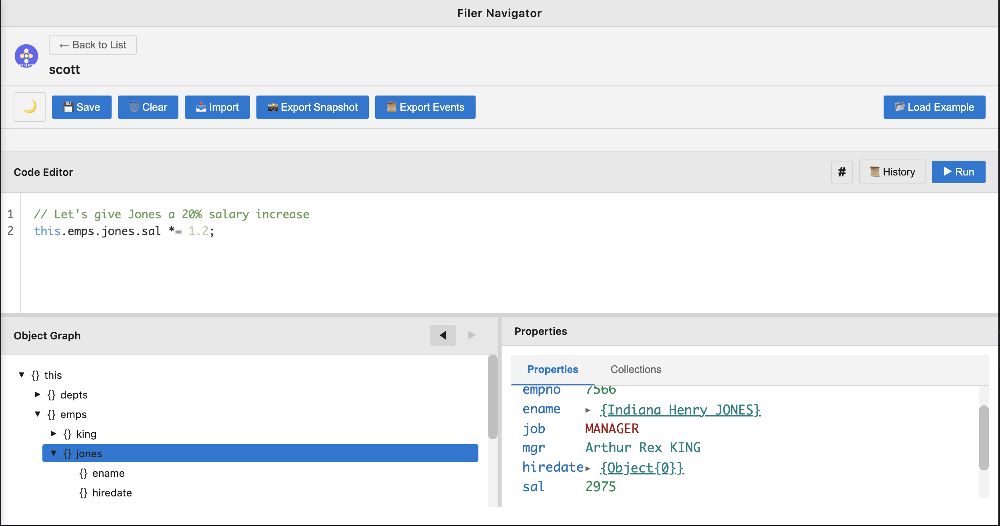

# Filer: Domain-Driven Development Without the Infrastructure

**Conceptual domain modeling + event-sourced transparent persistence + rich synthesized GUIs —all in-browser, no server, zero dependencies.** Define your domain at the conceptual level (e.g. E/R), and Filer synthesizes JavaScript prototypes, persistence, validation, and interactive UIs on the fly. Your data and its schema coexist as equals in the same memory image, enabling unprecedented flexibility: change the schema, existing data adapts automatically. No migrations, no ORMs, no impedance mismatch—just JavaScript objects that persist themselves and GUIs that materialize from metadata.



*Interactive domain exploration: navigate your object graphs, execute JavaScript, visualize relationships—all without a server or database.*

---

*Este documento está también disponible [en español](./README-es.md) e também disponível [em português](./README-pt.md).*

## Vision: Autonomous Domain Modeling

Filer empowers you to **define and enact your own domains locally**—without servers, databases, or infrastructure—while enabling seamless sharing and collaboration. Model your domain conceptually (e.g. *Employee, Department, Salary*), and Filer **synthesizes** the persistence layer, validation logic, and rich UI automatically. Change your schema? The system adapts instantly. Your data and metadata coexist in the same memory image, eliminating the schema/data divide that plagues traditional systems.

---

## Try It Now

**Zero installation. Zero configuration. Zero server.**

1. Download [`dist/index.html`](dist/index.html) (118KB, self-contained)
2. Open in your browser (works with `file://` protocol—no server needed)
3. Click **"Load Example"** to explore the classic EMP/DEPT schema
4. Navigate the object graph, inspect values, execute JavaScript in the REPL
5. All changes persist automatically—reload the page, your data is still there

That's it. No npm install, no database setup, no configuration files. Just open and start working.

The complete vision is still work in progress but it works and can be tested now!

---

## Why Filer?

### Transparent Persistence at RAM Speed

- **No ORM, no database, no impedance mismatch**: Your JavaScript objects persist themselves via transparent proxies
- **Event sourcing built-in**: Every mutation (`emp.sal = 5000`) is logged automatically as an event
- **Time-travel debugging**: Replay events to any point in history—inspect state at any timestamp
- **Full audit trail**: Complete history of all changes for compliance and debugging
- **Delta synchronization**: Transmit only events, not full state—efficient collaboration

### Rich GUI Synthesized from Metadata

- **Forms, tables, and inspectors generated on-the-fly** from your schema definitions
- **Schema-driven UI**: Change the schema, UI adapts instantly—no templates, no rebuilds
- **Zero code generation**: Everything is synthesized at runtime, always in sync
- **Type-safe data entry**: Validation rules enforced automatically via Proxy traps
- **IntelliSense and autocomplete** in the integrated editor (in the works)

### JavaScript IS the Query Language

- **No SQL, no query DSL**: Use JavaScript directly—`emps.filter(e => e.sal > 3000)`
- **Full programmatic access**: REPL for exploration, testing, and scripting
- **No context switching**: Stay in JavaScript for queries, mutations, and logic
- **Native performance**: No translation layer—direct object access at RAM speed

### REPL-Driven Development

- **Explore your domain interactively**: Test ideas before committing
- **Inspect object graphs visually**: Navigate relationships with the tree view
- **Execute scripts, save favorites**: Build a library of useful queries and operations (upcoming)
- **Immediate feedback**: See results instantly, no compile-rebuild-reload cycle

---

**Intrigued? Interested but skeptical?** Take a look at [Filer's vision in a nutshell](./docs/vision-in-a-nutshell.md) (somewhat long: ~20 pages). The brave and the curious may also want to peruse the  [Filer's complete vision](./docs/vision.md) (decidedly long: worth-reading 56 pages exploring the 40-year arc from UNIFILE to Prevayler to Filer, and why this convergence moment matters).

Visión completa [en español](./docs/vision-es.md) ([PDF](./docs/vision-es.pdf)).

Visão completa [em português](./docs/visao-pt.md) ([PDF](./docs/visao-pt.pdf)).

In a hurry? Keep reading!

---

## Architecture by Design

### No Implementation Dependencies

- **Pure JavaScript**: No external libraries in production code
- **Zero npm packages at runtime**: Self-contained, no dependency hell
- **No build tools required to run**: Open `dist/index.html` and go
- **Single 118KB file**: Everything inlined—HTML, CSS, JavaScript

### 100% In-Browser

- **Runs entirely in the browser**: No server-side processing required
- **IndexedDB for persistence**: Optional, for long-term local storage
- **LocalStorage fallback**: If IndexedDB unavailable
- **File-based persistence**: Available when running in Node.js

### No Server Required

- **Works with `file://` protocol**: No HTTP server needed (but that works as well!)
- **Can be served statically**: GitHub Pages, Netlify, Vercel, S3—any static host
- **Deployable anywhere**: Email the file, host it, or run it locally
- **Server-side execution supported**: MemImg works in Node.js for backend use

---

## Components

### MemImg: Event-Sourced Persistence Engine

**Standalone library. Works in browser and Node.js. Zero coupling to UI.**

MemImg wraps your JavaScript objects in transparent proxies that automatically log every mutation as an event. You don't call save()—objects persist themselves transactionally.

**How it works:**

```javascript
import { createMemoryImage } from './src/memimg/memimg.js';

const root = createMemoryImage({}, { eventLog });

// Every mutation is tracked automatically
root.emps = [];
root.emps.push({ empno: 7839, ename: "KING", sal: 5000 });
root.emps[0].sal = 5500;  // Logged as SET event

// Replay events to reconstruct state
const root2 = await replayEventsFromLog({ eventLog });
// root2 === root (same state, reconstructed from events)
```

**Capabilities:**

- **Transparent Persistence**: Just assign properties—`emp.sal = 5000`—and changes are logged
- **Time-Travel Debugging**: Replay events to any point in time
- **Delta Synchronization**: Efficient state transmission via event streams
- **Automatic Snapshots**: Serialize entire object graphs with cycle handling
- **Transaction Isolation**: Optimistic updates with commit/rollback (`save()` or `discard()`)

**Can be used standalone** for:
- Server-side persistence (Node.js)
- Offline-first applications
- Collaborative editing (CRDT-like via event logs)
- Undo/redo functionality
- Audit trails and compliance

**Quality**: 913 tests, 94.74% code coverage, 100% passing

---

### Navigator: Interactive Domain Explorer

**Browser-based REPL, object graph visualizer, and script editor.**

Navigator provides a rich UI for exploring and manipulating your domain model interactively:

- **Tree View**: Navigate nested object graphs visually—expand/collapse, drill down into references
- **Inspector**: View properties, values, and types inline—see everything about any object
- **Script Editor**: Write and execute JavaScript with syntax highlighting and autocomplete
- **Script History**: Save and reuse favorite scripts—build your own query library
- **Multi-Tab Interface**: Work with multiple Memory Images simultaneously—compare states side-by-side

**No configuration required**—just load your data and explore.

**Quality**: 427 tests, 100% passing

---

### Metadata: Executable Conceptual Domain Modeling

**Model your domain at the conceptual level. Filer synthesizes the rest.**

This is where Filer's power shines. Instead of writing classes, constructors, getters, setters, validation logic, and UI templates, you define your domain **conceptually**—like in Entity/Relationship or Object-Role Modeling—and Filer **synthesizes** JavaScript prototypes, object factories, persistence, validation, and rich GUIs on the fly.

**Conceptual Modeling:**

```javascript
const Dept = ObjectType({
  name: 'Dept',
  properties: {
    deptno: { type: NumberType, required: true, unique: true },
    dname:  { type: StringType, label: "Department Name" },
    loc:    { type: StringType, label: "Location" }
  }
});

const Emp = ObjectType({
  name: 'Emp',
  properties: {
    empno: { type: NumberType, required: true, unique: true },
    ename: { type: StringType, label: "Employee Name" },
    sal:   { type: NumberType, min: 0, label: "Salary" },
    dept:  { type: Dept, label: "Department" }  // Reference
  }
});
```

**What Filer Synthesizes Automatically:**

1. **Object factories** (not classes — JavaScript-centric, functional approach)
2. **Type safety enforcement** via Proxy traps—assign a string to `sal`? Runtime error.
3. **Forms and tables** generated from metadata—add a property, form updates instantly
4. **Data validation** based on constraints (required, min/max, unique, regex, custom)
5. **Referential integrity** maintained automatically—`dept` references are type-checked

**Synthesis, Not Code Generation:**

- **No build step**: Changes take effect immediately
- **No generated files**: Everything lives in memory, synthesized on demand
- **Always in sync**: Metadata IS the implementation—impossible to drift apart
- **Runtime introspection**: Examine and modify schemas at runtime

**The Metamodel: Metadata Describes Itself**

Here's the key insight: **The metadata system describes itself using itself.**

The types that define `Dept` and `Emp` (`ObjectType`, `NumberType`, `StringType`) are themselves defined using the same `ObjectType` factory. This means:

- The **same persistence machinery** that saves `Emp` instances can save the `Emp` schema definition itself
- The **same synthesized GUI** that edits employee records can edit the employee schema
- **Metadata and data coexist** in the same MemImg—no separate schema files, no migrations
- Users can **define and modify schemas interactively** via GUI, no diagramming tools required
- The metadata **enacts** the system into existence—metadata IS data IS the system

**This is *enaction***: The metadata doesn't merely describe the system—it **IS** the system.

---

## Metadata IS Data: No Migration Hell

Traditional systems separate schema (DDL) from data (rows). This creates friction:

- **Schema changes require migrations**: Add a column? Write migration SQL, version it, test it, deploy it.
- **Schema and data are versioned separately**: Schema at v12, data from v8? Good luck.
- **Export/import requires schema files**: Data without schema is useless, schema without data is empty.

**Filer collapses this distinction.**

Since metadata definitions (`Dept`, `Emp` types) are stored in the **same MemImg** as domain instances (actual employees), several powerful properties emerge:

### Export/Import "Just Works"

Serialize the MemImg → you get **both** metadata AND data in one JSON snapshot. Import it anywhere, and you have the complete, working system. No separate schema files, no version mismatches.

### Schema Evolution is Automatic

Add a property to `Emp`? Existing employee instances can receive default values automatically—no manual migration scripts.

Remove a property? Just stop referencing it in your metadata—existing data remains untouched (no cascade deletes needed).

Change a type? Validation adapts instantly because validation reads the live metadata at runtime.

### Metadata is Mutable

Since metadata lives in the same MemImg as data, you can **mutate the schema at runtime** just like any other object:

```javascript
// Add a new property to the Emp schema
Emp.properties.hireDate = { type: DateType, label: "Hire Date" };

// Forms and validation update immediately—no rebuild, no restart
```

This is **not** hot-reloading or live-reloading tricks. The metadata **IS** a JavaScript object in memory, and changing it changes the system's behavior instantly.

---

## Upcoming Features

### Purely Declarative Domain Definition (No-Code)

- Property configuration via forms** (no JavaScript required)—**already in the works**
- **Instant preview of synthesized UI** (not generated—no build step)
- **No migration tools needed**: Since metadata and data coexist in the same MemImg, schema evolution is automatic—change the `Emp` type definition, and existing `Emp` instances can adapt automatically
- **Visual schema designer** (drag-and-drop entity/relationship) —**might be implemented**

**Why "might be implemented" for visual designer?**

- Forms for editing metadata are **already in the works** (metadata uses the same synthesis engine)
- A drag-and-drop UI would be nice-to-have but not necessary
- JavaScript-based schema definition is actually quite concise

### LLM-Aided Controlled Natural Language

- **Describe your domain in plain English**: No code, no diagrams, just conversation
- **LLM translates to formal metadata specifications**: Natural language → `ObjectType` definitions
- **Interactive refinement**: Ask follow-up questions, adjust properties, preview results
- **Hands-free domain modeling**: From idea to working system in minutes
- **Example**: *"Create an Employee entity with name, salary, and a reference to Department"*

---

## Project Structure

```
filer/
├── src/
│   ├── memimg/              # Event-sourced persistence engine
│   ├── navigator/           # Interactive explorer/REPL
│   ├── metadata/            # Conceptual domain modeling
│   └── app/                 # Application shell
│
├── test/
│   ├── memimg/             # 913 tests, 94.74% coverage
│   ├── navigator/          # 427 tests, 100% passing
│   ├── metadata/           # Infrastructure ready
│   └── integration/        # Cross-component tests
│
└── dist/
    └── index.html          # Single-file deployable app (118KB)
```

---

## Development

### Prerequisites
- Node.js 22+
- npm

### Quick Start
```bash
# Clone repository
git clone https://github.com/xrrocha/filer.git
cd filer

# Install dependencies
npm install

# Build
npm run build

# Run tests
npm test                    # All tests
npm run test:memimg        # MemImg tests (913 tests)
npm run test:navigator     # Navigator tests (427 tests)
npm run test:metadata      # Metadata tests

# Coverage
npm run test:coverage

# Development mode
npm run dev
```

See [SETUP.md](SETUP.md) for detailed development environment setup (Linux/macOS cross-platform instructions).

---

## Philosophy

### Clarity Through Simplification

Filer embraces JavaScript's dynamic nature rather than fighting it. No TypeScript gymnastics, no ORM query builders, no code generation pipelines—just JavaScript objects enhanced with transparent persistence and schema-driven synthesis.

### Power Through Layering

The architecture is deliberately layered:

1. **MemImg** (Layer 1): Pure event sourcing, no UI coupling—usable standalone
2. **Navigator** (Layer 2): UI for exploration, no domain knowledge—works with any data
3. **Metadata** (Layer 3): Domain modeling and synthesis engine—brings it all together

Each layer works independently. Use MemImg alone for persistence. Use Navigator with any data structure. Combine all three for full power.

### Enaction Over Configuration

Traditional tools ask you to **describe** your domain (UML diagrams, ER models, TypeScript interfaces) and then **implement** it separately (write classes, migrations, UI templates). This creates **two sources of truth** that inevitably drift apart.

Filer collapses this dichotomy: **The metadata IS the implementation.**

- Define your schema once—persistence, integrity, and UI are synthesized automatically
- Change the schema—everything adapts instantly, no rebuild required
- The metadata doesn't describe the system—it **enacts** the system into existence

This is not configuration-over-code or convention-over-configuration. This is **enaction**: metadata **IS** data **IS** the system. There is no separation.

---

## License

Apache 2.0

---

## Contributing

Contributions welcome! Please read [SETUP.md](SETUP.md) for development environment setup (includes Linux/macOS portability instructions).

---

## Credits

**Author**: Ricardo Rocha
**Repository**: [github.com/xrrocha/filer](https://github.com/xrrocha/filer)

Partiture: Ricardo. Execution: Claude Code.  So far, so good.

---

## Inspiration & References

Filer builds on ideas from several foundational sources:

- **[Martin Fowler's Memory Image](https://martinfowler.com/bliki/MemoryImage.html)** - Core pattern for keeping the entire domain model in memory for performance and simplicity
- **[KMemImg](https://amauta.medium.com/memory-image-in-kotlin-a2b7782ed842)** - Previous implementation exploring memory image concepts in Kotlin
- **[Prevayler](https://prevayler.org)** - Pioneer in transparent, event sourcing-based object persistence for Java

- **[UNIFILE.pdf](https://rrocha.me/projects/filer/references/UNIFILE.pdf)** - Academic foundation exploring user-level conceptual modeling and visualization

***Filer: Because your domain model deserves better than an ORM.***
