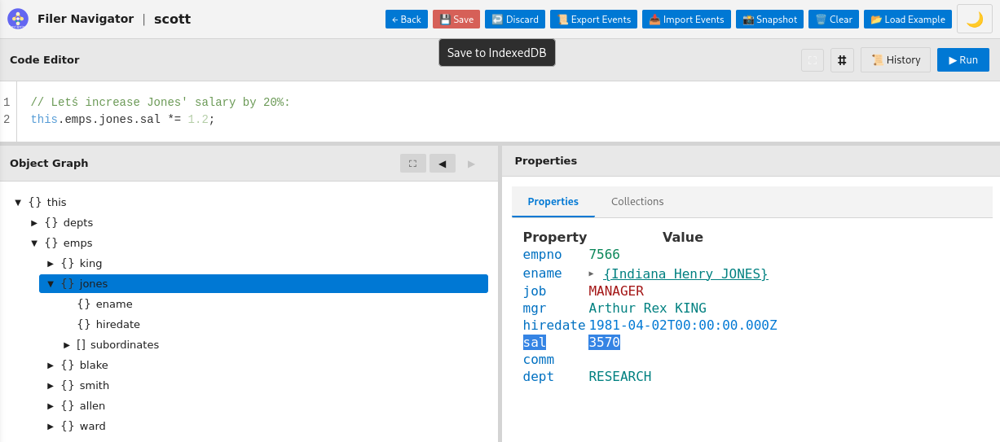

# Filer: From Data Model to Working App—Instantly

What if you could define your domain—a recipe collection, a reading list, a family tree, or yes, employees and departments—and immediately see a working app? No classes to write, no schemas to migrate, no UI templates to build, no deploy cycles. Just define your model and run it. Whether you're building personal tools or enterprise systems, the complexity is the same: it stems from separating metadata (your model) from data (your instances). When they're unified, an entire category of accidental complexity disappears: migrations, builds, code generation, version coordination. The result: software you can shape to your needs—personal, professional, or anywhere in between.

**This is Filer.**

---

## See It in Action



*Interactive domain exploration: navigate object graphs, execute JavaScript, visualize relationships—all without a server or database.*

### Try It Now (Zero Setup)

1. Download [`dist/index.html`](dist/index.html) — one self-contained 140KB file
2. Open it in your browser (works with `file://` protocol—no server needed)
3. Click **"Load Example"** to explore a working Employee/Department schema
4. Navigate the object graph, inspect values, execute JavaScript in the REPL
5. Make changes—reload the page, your data is still there

**That's it.** No npm install, no database setup, no configuration. Just open and start working.

---

## The Key Insight: Metadata IS Data

Traditional systems separate schema (DDL) from data (rows). This creates migration hell:


*Traditional approach vs. Filer: schema and data unified in a single memory image*

**The problem with separation:**
- Schema changes require migrations → write SQL, version it, test it, deploy it
- Schema and data versioned separately → schema v12, data from v8? Debug nightmare
- Export/import breaks → data without schema is useless, schema without data is empty

**Filer collapses this distinction.**

Schema definitions (`Employee`, `Department` types) live in the **same persistent memory image** as the actual data (employee records). This simple architectural choice eliminates entire categories of problems:

### No Migrations, Ever

Change your schema → existing data adapts automatically. Add a property? Instances get default values. Remove a property? Just stop referencing it. Change a type? Validation updates instantly.

```javascript
// Modify schema at runtime
Emp.properties.hireDate = { type: DateType, label: "Hire Date" };

// Forms and validation update immediately—no rebuild, no restart
```

### Export/Import Just Works

Serialize the memory image → you get **both** schema and data in one file. Import it anywhere, and you have the complete working system. No separate schema files. No version coordination. No impedance mismatch.

### Schema Changes = Instant UI Updates

Metadata doesn't just *describe* the system—it **IS** the system. Change the schema, and forms, validation, and UI adapt instantly because they're synthesized from the live metadata at runtime.

This isn't hot-reloading tricks. The metadata is a JavaScript object in memory. Change it, and the system's behavior changes. Immediately.

---

## How It Works: Three Independent Layers

### MemImg: Event-Sourced Persistence Engine

Objects persist themselves automatically via transparent proxies. No save() calls, no ORMs.

```javascript
import { createMemoryImage } from './src/memimg/memimg.js';

const root = createMemoryImage({}, { eventLog });

// Every mutation is tracked automatically
root.emps = [];
root.emps.push({ empno: 7839, ename: "KING", sal: 5000 });
root.emps[0].sal = 5500;  // Logged as SET event

// Replay events to reconstruct state at any point in time
const root2 = await replayEventsFromLog({ eventLog });
```

**Capabilities**: Time-travel debugging, full audit trail, delta synchronization for collaboration, transaction isolation with commit/rollback.

**Standalone library**: Works in browser and Node.js. Zero UI coupling. Can be used for server-side persistence, offline-first apps, undo/redo, audit trails.

**Quality**: 929 tests, 94% code coverage, 100% passing.

[Read the theoretical foundations](./docs/memimg-theory.md)

### Navigator: Interactive Domain Explorer

Browser-based REPL with tree view, property inspector, and script editor.

**Features**: Navigate nested object graphs visually, inspect properties inline, write and execute JavaScript with syntax highlighting, save and reuse scripts, work with multiple memory images simultaneously.

**Standalone**: Works with any data structure—no domain knowledge required.

**Quality**: 427 tests, 100% passing.

### Metadata: Executable Conceptual Modeling

Define your domain conceptually—like Entity/Relationship modeling—and Filer synthesizes persistence, validation, and UI automatically.

```javascript
const Dept = ObjectType({
  name: 'Dept',
  properties: {
    deptno: { type: NumberType, required: true, unique: true },
    dname:  { type: StringType, label: "Department Name" },
    loc:    { type: StringType, label: "Location" }
  }
});

const Emp = ObjectType({
  name: 'Emp',
  properties: {
    empno: { type: NumberType, required: true, unique: true },
    ename: { type: StringType, label: "Employee Name" },
    sal:   { type: NumberType, min: 0, label: "Salary" },
    dept:  { type: Dept, label: "Department" }  // Reference
  }
});
```


*From conceptual model to working UI: Filer synthesizes forms, validation, and persistence from metadata*

**What gets synthesized automatically:**
- Object factories (functional, not class-based)
- Type safety via Proxy traps (assign string to `sal`? Runtime error)
- Forms and tables generated from metadata (add a property, form updates instantly)
- Validation based on constraints (required, min/max, unique, regex, custom)
- Referential integrity (type-checked references)

**No code generation**: Everything synthesized at runtime. Metadata and UI always in sync—impossible to drift apart.

**Status**: Foundation complete, synthesis in progress.

---

## Why You'll Love It

- **No migrations**: Schema evolution is automatic—change your model, existing data adapts
- **Event sourcing built-in**: Time-travel debugging, complete audit trail, delta synchronization for collaboration
- **Zero setup**: Download one HTML file (140KB), open it, done—works offline with `file://` protocol
- **JavaScript IS the query language**: `emps.filter(e => e.sal > 3000)`—no SQL, no ORM, no DSL
- **Schema changes = instant UI**: Metadata drives forms, tables, and validation at runtime
- **Single-file deployment**: Everything inlined—HTML, CSS, JavaScript—email it, host it anywhere

---

## Get Started

### Try It (No Installation)

Download [`dist/index.html`](dist/index.html) and open it in your browser. That's it.

### Develop

```bash
git clone https://github.com/xrrocha/filer.git
cd filer
npm install
npm test          # 1,359 tests, 94% coverage
npm run dev       # Development server with hot reload
```

See [SETUP.md](SETUP.md) for detailed development environment setup.

---

## Vision: From Natural Language to Working App

The metadata synthesis engine that powers Filer today opens a compelling future possibility:


*From conversation to application: natural language translated into formal metadata, synthesized into a working app*

**What if domain modeling was conversational?**

*"I need to track employees, departments, and salaries. Employees belong to departments and have hire dates..."*

An LLM could translate this into formal `ObjectType` definitions, which Filer would immediately synthesize into a working application—just like it does with hand-written metadata today.

The foundation exists. The synthesis engine works. This is where we're heading.

---

## Learn More

- **[Vision in a Nutshell](./docs/vision-in-a-nutshell.md)** — Quick overview of Filer's approach
- **[Complete Vision](./docs/vision.md)** ([PDF](./docs/vision.pdf)) — The 40-year arc from UNIFILE to Prevayler to Filer
- **[Theoretical Foundations](./docs/memimg-theory.md)** ([PDF](./docs/memimg-theory.pdf)) — How MemImg's event sourcing works
- **[Development Setup](./SETUP.md)** — Cross-platform development environment setup

---

## Philosophy

**Clarity Through Simplification**: Filer embraces JavaScript's dynamic nature rather than fighting it. No TypeScript gymnastics, no ORM query builders, no code generation pipelines—just JavaScript objects enhanced with transparent persistence and schema-driven synthesis.

**Power Through Layering**: Each layer works independently. Use MemImg alone for persistence. Use Navigator with any data structure. Combine all three for full power.

**Enaction Over Configuration**: Traditional tools ask you to *describe* your domain (UML diagrams, ER models, TypeScript interfaces) and then *implement* it separately (classes, migrations, UI templates). This creates two sources of truth that inevitably drift apart.

Filer collapses this dichotomy: **The metadata IS the implementation.** Define your schema once—persistence, validation, and UI are synthesized automatically. Change the schema—everything adapts instantly. The metadata doesn't describe the system—it **enacts** the system into existence.

---

## Inspiration & References

Filer builds on ideas from several foundational sources:

- **[Martin Fowler's Memory Image](https://martinfowler.com/bliki/MemoryImage.html)** — Core pattern for keeping the entire domain model in memory
- **[Prevayler](https://prevayler.org)** — Pioneer in transparent, event sourcing-based object persistence for Java
- **[KMemImg](https://amauta.medium.com/memory-image-in-kotlin-a2b7782ed842)** — Previous implementation exploring memory image concepts in Kotlin
- **[UNIFILE.pdf](https://rrocha.me/projects/filer/references/UNIFILE.pdf)** — Academic foundation exploring user-level conceptual modeling and visualization

---

## Contributing

Contributions welcome! Please read [SETUP.md](SETUP.md) for development environment setup.

---

## License

Apache 2.0

---

## Credits

**Author**: Ricardo Rocha
**Repository**: [github.com/xrrocha/filer](https://github.com/xrrocha/filer)

*Partiture: Ricardo. Execution: Claude Code. So far, so good.*

---

***Filer: Because your domain model deserves better than an ORM.***
